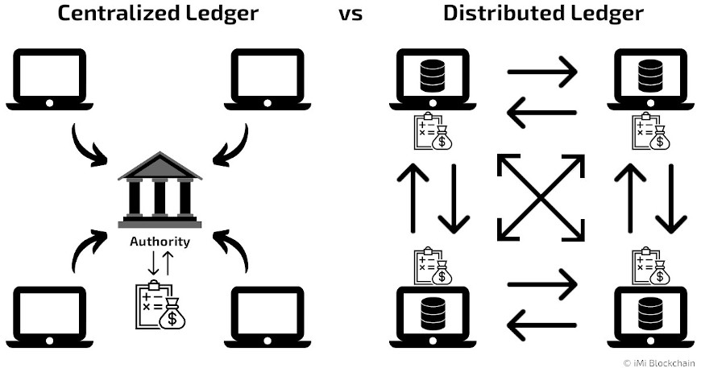
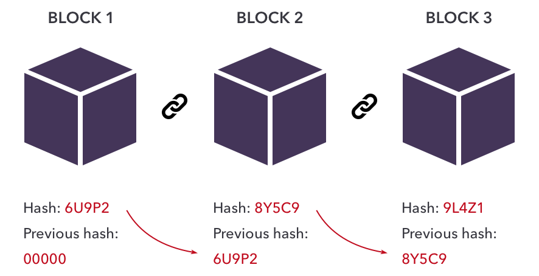

# Blockchain Overview

## What is Blockchain?



Blockchain is an adnaved database mechanism and a form of distributed ledger that validates data in blocks with connected peer nodes. Data will be replicated on each nodes and no modification of data is allowed unless the network consent to the action(s). This prevents unauthorised transactions in the network and allow consistency of data across different nodes.

## Distributed Ledger vs Blockchain

Distributed Ledger is a database spreading across several nodes that replicates identical copy of ledger records. Each node votes on the new ledger (consensus algorithm), updates itself independently and not maintained by central authority. This results in decentralised activities without the need of dependence on government, banks or compliance authority. This presents a new way for individual to have rights over their own record and information across the network.



Blockchain is a form of distributed ledger technology. All blockchains are distributed ledgers but not all distributed ledgers are blockchains. The difference is how data are strcutured in blockchain networks. Data are grouped as blocks, linked to one another chronologically and encrypted securely. This meant that blockchain only supports an append-only structure for a continuous growing list of new ledgers.

## Consensus Algorithm

### Proof of Work (PoW)

Computationally expensive algorithm for miners to mine blocks to obtain the correct hash and add the hash to the next block to mine.

```bash
# Example of finding hash of block that starts with '555'
sha256("0"); // 5feceb…
sha256("1"); // 6b86b2…
sha256("2"); // d4735e…
// keep on guessing, keep on guessing…
sha256("5118"); // 555850…
```

This algorithm prevents spammers from flooding the network as each new action would require a new hash to be mined which computationally takes time. Bitcoin uses PoW to reward miners for every block mined with the correct hash. In order for PoW network to be disrupted, it requires a 51% control of hashing power within the network but it may be too costly to achieve.

### Proof of Stake (PoS)


Validators are chosen to create new blocks based on the amount of cryptocurrency they hold or "stake". It reduces the need for computational work and energy consumption. The validator is then responsible for checking that new blocks propagated over the network are valid and occasionally creating and propagating new blocks themselves. If they try to defraud the network (for example by proposing multiple blocks when they ought to send one or sending conflicting attestations), some or all of their staked cryptocurrency can be destroyed. Ethereum 2.0 uses PoS as their consensus algorithm.

### Delegated Proof of Stake (DPoS)

It is based on PoS and network users vote to delegate block validation rights. There will be a limit of delegates for each block and delegators may not always delegate the subsequent blocks. Voters will stake their cryptocurrencies and vote their delegator to validate a block. Delegator with most votes will validate the block, get transaction fees as rewards and distribute to voters who chose the current delegator. Voters can vote out any delegator that attempts malicious activities. EOS and Tron uses DPoS as their consensus algorithm.

## Use Cases of Blockchain

* Banking and Finance Transactions
* Stock Trading
* Crowdfunding
* Voting System
* Wills & Inheritances
* Health Information Exchange
* Law Enforcements

## Public vs Private Blockchain

### Public Blockchains Uses

* Bitcoin
* Ethereum
* Dock

### Public Blockchains Advantages

* Decentralisation and transparency
* Security due to distributed consensus algorithm and secure cryptographic protocols
* Immutability from alteration

### Public Blockchains Disadvantages

* Speed
* Scalability
* Energy Consumption

### Private Blockchains Uses

* Hyperledger
* Corda

### Private Blockchains Advantages

* Effienct due to fewer participants
* Control over data and transactions
* Privacy by restricting who can be in the network

### Private Blockchains Disadvantages

* Centralisation
* Trust
* Isolation from other networks

## Interview Questions

* How does Blockchain differ from traditional databases?
* How does consensus algorithm work in blockchain and explain some practical uses.
* Identify advantages and disadvantages to both public and private blockchains.

## Author

- [Zheng Jie](https://github.com/Bread7) 🍞

## References

1. [Alchemy - Blockchain 101](https://docs.alchemy.com/docs/blockchain-101)
2. [Web3 Jobs - Interview Questions](https://web3.career/learn-web3/blockchain-developer-interview-questions#how-does-consensus-work-in-a-blockchain-network-and-what-are-some-popular-consensus-algorithms)
3. [Knowledge Hut - Interview Questions](https://www.knowledgehut.com/interview-questions/blockchain-interview-questions)
4. [AWS - Blockchain Technology](https://aws.amazon.com/what-is/blockchain/?aws-products-all.sort-by=item.additionalFields.productNameLowercase&aws-products-all.sort-order=asc)
5. [Shaan - Blockchain vs Distributed ledgers](https://towardsdatascience.com/the-difference-between-blockchains-distributed-ledger-technology-42715a0fa92)
6. [CBInsights - Industries blockchain could transform](https://www.cbinsights.com/research/industries-disrupted-blockchain/)