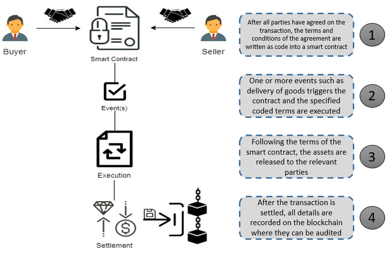

# Smart Contract

## What are smart contracts? 

Smart contracts are used on blockchain networks to offer interactions with developers to make transactions occur after specific parameters or functions. They are widely used in Ethereum Virtual Machines (EVM) blockchain networks with some implementation in other blockchain networks such as [Plutus](https://developers.cardano.org/docs/smart-contracts/plutus/) in Cardano or [Script](https://en.bitcoin.it/wiki/Script) in bitcoin. Having a smart contract allows automation of transaction when specific event occurs or allowing easy transaction to transfer money to another address via function invoke, thus allowing flexibility and liquidity in a blockchain network.

## Languages used for smart contracts in EVMs

### High Level Languages

* [Solidity](https://soliditylang.org/)
* [Vyper](https://github.com/vyperlang/vyper)

Both are high level programming languages used to design smart contracts for EVM based blockchain networks which will be converted into bytecode using Application Binary Interface (ABI) before deploying into the network. Solidity allows inheritance, modifiers and various manipulations of contract even at runtime after deploying to execute complex functions. Vyper is security focused language and loses on flexibility in the language thus, making it used for simpler use cases, reduce writing vulnerable code and allow easier audit of contract. 

### Low Level Languages

* [Huff](https://huff.sh/)

Huff is a low level programming language that can be used to produce highly optimized smart contracts. It uses macros and opcodes to craft the contracts and does not require an ABI for deployment. Due to a lack of ABI, it can convert the smart contract into smaller bytecodes for deploying, reducing potential gas fees for the contract.

## How does transaction occur in smart contracts? 



A developer would draft up a smart contract between 2 parties once the terms are agreed upon mutually. After developing the smart contracts, it will be deployed onto the blockchain network and exists with an address that may or may not allow external invocation.

```solidity
// SPDX-License-Identifier: MIT
pragma solidity ^0.8.24;

contract ReceiveEther {
    // Function to receive Ether. msg.data must be empty
    receive() external payable {}

    // Fallback function is called when msg.data is not empty
    fallback() external payable {}

    function getBalance() public view returns (uint256) {
        return address(this).balance;
    }
}

contract SendEther {

    function sendViaSend(address payable _to) public payable {
        // Send returns a boolean value indicating success or failure.
        // This function is not recommended for sending Ether.
        bool sent = _to.send(msg.value);
        require(sent, "Failed to send Ether");
    }

    function sendViaCall(address payable _to) public payable {
        // Call returns a boolean value indicating success or failure.
        // This is the current recommended method to use.
        (bool sent, bytes memory data) = _to.call{value: msg.value}("");
        require(sent, "Failed to send Ether");
    }
}
```

Above shows 2 contracts, one is to send and one is to receive ETH. While it is not necessary to have a contract to receive ETH as you can directly send to their Ethereum wallet public address, it depends on the use case. Both functions in the `SendEther` contract will only transfer money when their functions are called externally.

```javascript
// example values using hardhat environment
const contract = await hre.ethers.getContractAt("SendEther", 12312312412352346234);
contract.sendTransaction({
    to: 7897897789789789,
    value: ethers.utils.parseEther("1.0"),
});
```

After transactions have occured, both the action of sending and receiving ethers will be recorded onto the blockchain usually with a transaction hash to signify the record. This allows audit of the record to ensure no malicious man in the middle tampering of the transactions and transparency for everyone in the blockchain network.

## Interview Questions

* What are the various languages used to develop smart contracts?
* Explain the transaction process in a smart contract.
* What are some vulnerabilities in the example smart contract code?

## Author

- [Zheng Jie](https://github.com/Bread7) 🍞

## References

1. [Alchemy - Solidity vs Vyper](https://www.alchemy.com/overviews/solidity-vs-vyper)