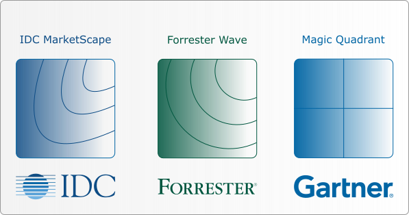

---
layout:
  title:
    visible: true
  description:
    visible: false
  tableOfContents:
    visible: true
  outline:
    visible: true
  pagination:
    visible: true
---

# Market Research Reports and Perception

Understanding market perception and industry trends is crucial for businesses to stay competitive and innovative. To do this, market research reports like Gartner's Magic Quadrant, Forrester's Wave, and IDC MarketScape play an important role in providing insights into how various cybersecurity products are viewed in the market.&#x20;

## **Understanding Key Market Research Tools**

1. **Gartner’s Magic Quadrant**: This research methodology provides a graphical competitive positioning of four types of technology providers in fast-growing markets: Leaders, Visionaries, Niche Players, and Challengers. Gartner evaluates companies based on their ability to execute and their completeness of vision. This is repesented by a 4 quadrant style where each quadrants along with the x and y axis represent the standing of the target organisation.
2. **Forrester’s Wave**: Similar to the Magic Quadrant, the Forrester Wave evaluates cybersecurity vendors across a detailed spreadsheet on various criteria that measure current offering, strategy, and market presence. The results categorize vendors into Leaders, Strong Performers, Contenders, and Challengers. This is done in a corner wave style, where the top right, "core" of the wave represents the strongest players, followed by the "softer" waves.&#x20;
3. **IDC MarketScape**: This tool uses a rigorous scoring methodology that produces a graphical assessment of each vendor’s market position, sized according to market share and growth rates. It focuses on the capabilities and strategies that have been shown to be most effective in gaining market traction. Similar to Forrester's wave but done in a contour style graph.&#x20;

<figure><figcaption></figcaption></figure>

## **Steps to Utilize Market Research Reports for Cybersecurity Products**

**Step 1: Access and Collect Relevant Reports**

* Start by gathering the latest editions of relevant market research reports that focus on cybersecurity. Since these reports can be expensive, prioritize those most relevant to your specific segment of the cybersecurity market. Alternatively, leaders in the various reports offer access to them in trade for your email address and information.&#x20;

**Step 2: Analyze Vendor Positioning**

* Examine where different cybersecurity vendors are placed in these reports. For instance, look at which companies are labeled as Leaders, Challengers, Niche Players, or Visionaries in Gartner’s Magic Quadrant. This categorization helps identify the companies that are excelling in the industry and those that are seen as up-and-comers.

**Step 3: Understand the Criteria**

* Look into the criteria used for evaluation. Understanding the benchmarks like innovation, business model, market responsiveness, customer experience, and geographic strategy will help you assess why certain vendors are rated higher than others.

**Step 4: Read Analyst Insights and Predictions**

* Pay close attention to the textual analysis and predictions in these reports. Analyst insights can provide context behind the rankings, highlighting strengths, weaknesses, opportunities, and threats facing different vendors.

**Step 5: Compare Multiple Reports**

* Since different research firms have varying focuses and methodologies, comparing findings across different reports can provide a balanced view of the market. This cross-referencing helps validate the findings and offers a more nuanced understanding of each vendor’s market position.

**Step 6: Look for Trends and Patterns**

* Identify trends in vendor performance over time and across reports. This can indicate rising stars or declining veterans in the cybersecurity field. Trends can also reveal overarching market shifts, such as a move towards cloud-based security solutions.

## Interview Questions

* What is the common known industry secret of Gartner's Magic Quadrant that makes their market research reports less ideal than the other 2 organizations''.
* "Given a situation where multiple cybersecurity vendors are rated similarly in Forrester's Wave, how would you evaluate and determine which vendor’s product to adopt for our company's needs? What additional factors would you consider beyond the report's scope to make your decision?"

## Author

[Joseph](https://www.linkedin.com/in/josephlimgq/)

