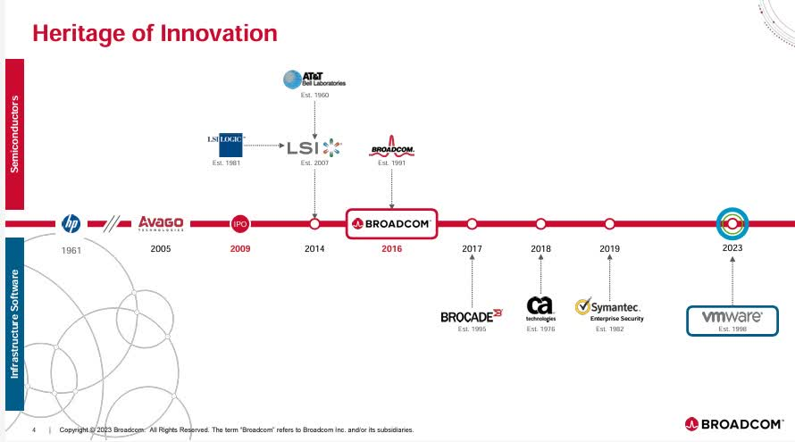

# Understanding Acquisitions

In the rapidly evolving field of cybersecurity, acquisitions are a critical strategy for companies aiming to expand their capabilities, enter new markets, and stay ahead of technological advancements. By acquiring other companies, businesses can quickly gain access to new technologies, talent, and customer bases, which is particularly valuable in an industry that requires constant innovation to counteract emerging threats.&#x20;

This article will cover briefly the different acquisitions and deep dive into Broadcom, a semi-conductor manufacturing company that in the past 5 years, have been making major moves that significantly changed the cybersecurity industry from a business perspective.&#x20;

## Types of Cybersecurity Acquisitions

Acquisitions in cybersecurity, like many other industries can be classified in a few key types. Below lists a few common occuring acquisition types, but may not be limited to these few only.

1. **Technology-Focused Acquisitions**: These are aimed at obtaining advanced technology or specific cybersecurity solutions that can complement or enhance the acquirer's existing offerings. This type often targets startups with innovative solutions that can fill gaps in the acquirer’s product line or introduce new capabilities.
2. **Market Expansion Acquisitions:** These acquisitions are pursued to enter new geographic markets or verticals. Companies might acquire regional players to quickly gain a foothold in markets where they previously had limited presence.
3. Competitor Takeout: These acquisitions are positioned to allow the acquiring company to quickly remove potential up and coming market competitors in order to retain market leader status and keep revenue streams viable.&#x20;

## Who is Broadcom?

Broadcom Inc. is a global technology leader that designs, develops, and supplies a broad range of semiconductor and infrastructure software solutions. Founded as a division of Hewlett-Packard in 1961 and later incorporated in 1991, Broadcom has evolved significantly over the decades. The company's product line includes data center networking, home connectivity, broadband access, telecommunications equipment, and more. Broadcom is also well-known for its strategic acquisitions, which have expanded its portfolio into various technological domains, including cybersecurity.

<figure><figcaption>
Acquisition Timeline for Broadcom
</figcaption></figure>

## Broadcom and Its Strategic Acquisitions

Broadcom has strategically used acquisitions to bolster its market position and expand its technological capabilities. Key acquisitions have not only enhanced Broadcom's product portfolio but also positioned the company as a significant player in various sectors, including cybersecurity, which it was previously not a noteworthy player of.

#### Notable Acquisitions

* **Symantec's Enterprise Security Business:** Acquired for $10.7 billion in 2019, this move significantly enhanced Broadcom's footprint in the cybersecurity domain, providing a range of security services from endpoint protection to cloud security.
* **VMWare Business:** Acquired for approximately $61 billion in May 2022, this move was aimed at significantly enhancing Broadcom's portfolio in the cloud computing and enterprise software sectors, aligning with Broadcom's ongoing expansion into software following its previous acquisitions of CA Technologies and Symantec's enterprise security business.

## Interview Questions

* What is Broadcom's typical approach in handling acquired companies?
* The acquired companies were leaders in their respective fields, with significant market share. How has these acquisitions affected the clients of these organizations?&#x20;
* How has the market shifted from the acquired companies to their competitors?

## Author

* [Joseph](https://www.linkedin.com/in/josephlimgq/)

