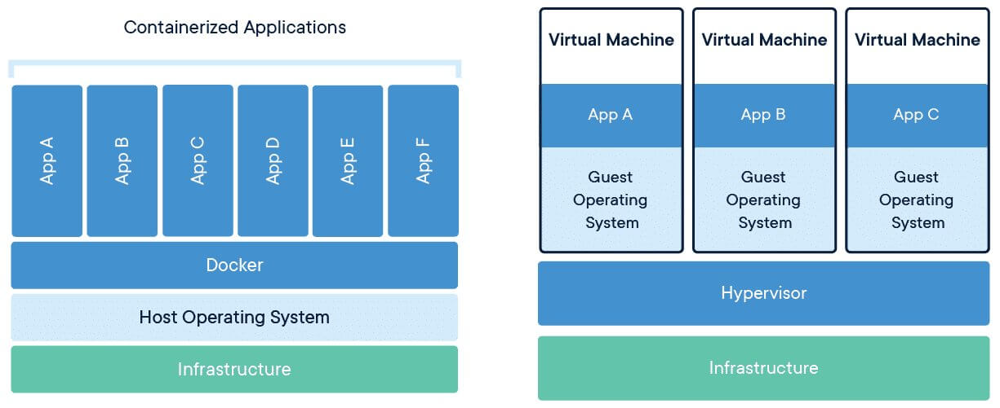

# Docker Overview

## What is Docker?

A platform to help deploy and run applications quickly. It containerises (virtualisation) the application to separate from the OS infrastructure without relying on your OS but the resource of the underlying hardware. This allows deployment on servers that may differ in OS but do not require a specific OS build script to build and deploy.

## Containers vs Virtual Machiines

Virtual machines rely on hypervisor to separate the resource and create multiple virtual servers from a singular hardware server. This multiplies the number of application dependencies per virtual servers. In most situations, a dedicated virtual server is not needed to run a single application.

Containers installs a barebone linux image with only the necessary packages needed to run the application therefore, it tends to be very small and lightweight. As such container orchestration tool like Kubernetes may be needed to manage massive numbers of containers.

## Use Cases

### Microservices Architecture

As discussed in [Microservices](../software-architecture/microservices/overview.md), loosely coupled and independent services are essential to the architecture. Container helps to fulfill the requirements by separating services while accelerating development and deployment time. Docker's multi stage build feature enables incremental migration without the need to rebuild the infrastructure. This helps in building modular and scalable solutions.

### App Development Improvements

Containers allows easy packaging of apps and dependencies into a single unit and reduce the need for manual configuration for each environment. Furthermore, testing can also be automated into the build file so there is no need for dedicated test scripts due to host OS differences. This allows more time spent on app development and modification of build and test scripts can be applied to all containers.

### Consistent Environment Deployments

Everyone's environment for development, building and testing will differ which may chance upon different errors. Containerization helps to maintain a single stable build OS image that can be deployed on different devices without relying on their host environment. Having isolation and consistent replication enables smooth process between different deployment environments.



## Container Alternatives







## Interview Questions

* Explain how containers work?
* What are the difference(s) between containers and virtual machines?
* Name 5 use cases of containerizations.

## Author

- [Zheng Jie](https://github.com/Bread7) 🍞

## References

1. [Docker - Overview](https://docs.docker.com/get-started/overview/)
2. [RedHat - Containers vs VMs](https://www.redhat.com/en/topics/containers/containers-vs-vms#which-one-should-i-use)
3. [Folio3 - Docker Use Cases](https://cloud.folio3.com/blog/docker-use-cases/)