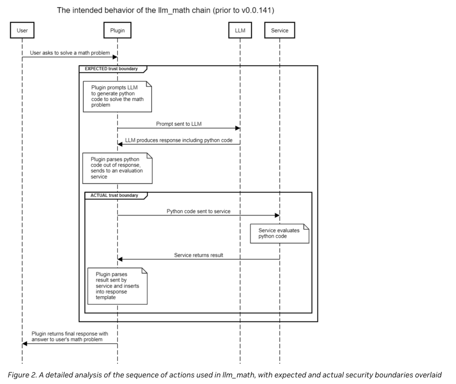
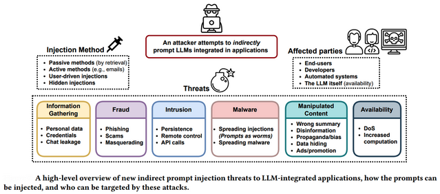

# LLM Defense

## Introduction

In this section, we look to dive into protection of LLM and its integration processes to prevent malicious usage by attackers. [LangChain](langchain-overview.md) has explained some basic concepts and usages of its capabilities. It can also be used as potential attack vectors and malicious endpoint. 

## Example of LangChain Process Flow using `llm_math`

Credits to [Nvidia](https://developer.nvidia.com/blog/securing-llm-systems-against-prompt-injection/)

## Issues with Model Inputs Using LangChain

With LangChain's rising popularity and usage to communicate with models, LangChain can be used as an offensive tool to inject malicious prompts that the model API Endpoint or the model itself may not properly sanitize. Because of rapid developmenet and deployment to public, designs of such tools may be inadequate and lack security enhancements. Recent developments have shown possibilities revolving arbitrary malicious input from attackers to control the output of the LLM.

Exploited Proof of Concepts (PoCs) using `llm_math` are further discussed in [LLM Attacks](attacks.md).

## Securing the Process

Recommended to use LangChain's latest version to avoid pitfalls of vulnerable APIs that malicious actors can abuse. Reduce the use of plugins from packages, create custom plugins if possible otherwise, treat external plugins with lowest level of privilege.

Data and Control (context passing) planes are inseparable and sometimes passed by user, important to always sanitize inputs on both ends. Parameterized queries can help to maintain a lower privileged context as well.



Paraphrasing can be used as possible mitigation method to prompt injection. This may break the order of the payload within the input which helps reduce malicious input execution.

Data prompt isolation to prevent malicious code within the data input to override the current instruction/context prompt. Solely treating data prompt as data input could reduce Context Ignoring attacks. Delimiters such as `'''` or `<xml>` and other tags have to be carefully treated to prevent execution during data prompting.

Sandwich prevention prefixes an instrcution prompt to ensure the LLM do not modify its original context and prevents attacker's injected instruction to execute. However, it reduces flexibility in allowing normal users from performing custom prompts. Therefore, context should be carefully managed and a limiter could be used to detect if context has been shifted maliciously and only then, revert to its original instructions.



## Interview Questions

* LLM integration into existing products is a trend to boost productivity, how do you secure LLM integration and pipelines?
* What defense techniques can be used to secure API functions?

## Author

- [Zheng Jie](https://github.com/Bread7) 🍞

## References

1. [LLM Security - Defense](https://llmsecurity.net/#defenses--detections) - Fantastic resource links
2. [Nvidia - Prompt Injection Defense](https://developer.nvidia.com/blog/securing-llm-systems-against-prompt-injection/)
3. [AWS - Architect Defense for Generative AI](https://aws.amazon.com/blogs/machine-learning/architect-defense-in-depth-security-for-generative-ai-applications-using-the-owasp-top-10-for-llms/) - Maybe write in separate topic
4. [Lakera - Insights to LLM Security](https://www.lakera.ai/blog/llm-security#real-world-insights-and-resources-in-llm-security)
5. [Neeraj - LLM Defense Strategies](https://medium.com/@nvarshney97/llm-defense-strategies-45457549c78e) - To incorporate in the future
6. [OWASP - Top 10 LLM Vulnerabilities](https://owasp.org/www-project-top-10-for-large-language-model-applications/assets/PDF/OWASP-Top-10-for-LLMs-2023-v1_1.pdf)
7. [Microsoft = AI/ML Security](https://learn.microsoft.com/en-us/security/engineering/threat-modeling-aiml) - To incorporate in the future
8. [Paper - Prompt Injection and Defenses in LLM-Integrated Applications](https://arxiv.org/pdf/2310.12815.pdf) - Can further explore the paper