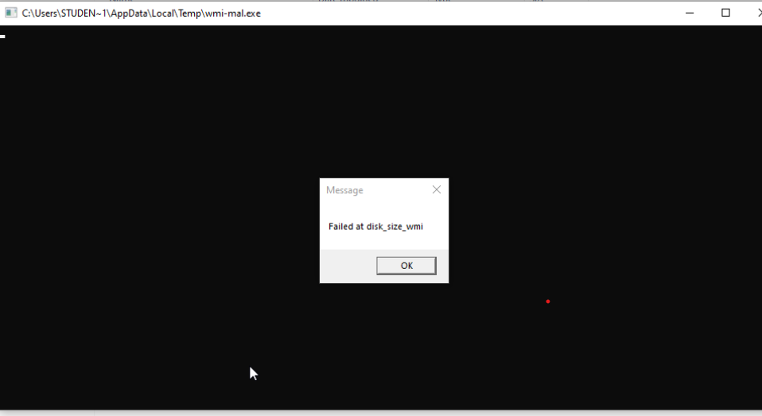

# Dynamic Sandbox Limitations

The use of malware sandbox more often than not, is for dynamic malware analysis, used in environments where a great number of malware samples are submitted to be analysed fast and effectively. However this comes with its limitations as well since the system is not perfect.

### Disadvantages of (Dynamic) Sandboxes:

There are a large number of Sandboxes (Don't get me wrong, it is still a good solution, just need to use correctly)

#### Environment difference

* Different malware types may require different type of environment to run
* i.e. `.elf` malware types require `UNIX` systems to run, and `Portable Executable` (PE) type or better seen as `.exe` file types may require windows to run as it might require windows specific `Dynamic Link Libraries` (DLL)
* Missing of required sandbox environment may lead to a poorer analysis conducted as the malware may not even detonate in the environment due to mismatch

#### Evasion Techniques

This portion is too large to cover in a single document, as there are a great number of malware evasion techniques for both `Windows` and `UNIX` system. A good guide to refer to for `Windows` would be https://evasions.checkpoint.com/src/Evasions/

These techniques are usually ways malware break out of their behaviours to avoid detonation in a sandbox environment so that analysis of them fails.

Example: I created a simple malware that does the following using Al-Khaser's code, here is the main code snippet that we have in C++&#x20;

<figure><figcaption><p>Sample code in C++ of altered Al-Khaser Test malware</p></figcaption></figure>

&#x20;So what the code does is that it will run WMI queries that will pass in a normal machine, but fail in a VMware or QEMU virtual machine. I later on added print statements to indicate which function it failed at as the program exits without showing anything if it fails, which is not reflected in the above screenshot.

If it successfully pass, it would show this:&#x20;

<figure><figcaption><p>Success Message after running on a host</p></figcaption></figure>

However, on a VM that is not configured, it would reveal this (After the print statements were added to show the function it failed at):&#x20;

<figure><figcaption><p>Failed run of the same Test Malware on a Virtual Machine</p></figcaption></figure>

So that is a summary of the evasion, its just a fraction of the whole part because there are many things to note in Malware sandbox evasion.

#### Time sensitivity

This is partially a subset of the Sandbox Evasion as dynamic analysis tend to do their analysis in short periods of time, mostly due to the large amounts of samples submitted, take VirusTotal for example, it usually takes _a few seconds to a few minutes._ This means that if I put my malware to sleep, lets say 1 hour, the sandbox will not be able to detect it in this few seconds or minutes of it running without doing special things to the environment.

So how do sandboxes counter this?

* Dynamic Debugging:
  * Instructions are step through upon execution, but usually requires a human intervention
* Hooking:
  * Instructions are intercepted and bypassed
* Accelerated time:
  * The machine clock is boosted and the time is sped up, leading sleeping malwares to execute on time

And malware can still counter some of these by having checkers to check accelerated time, this is a code snippet from Al-Khaser to check for accelerated time:

```cpp
/*
Sleep and check if time have been accelerated
*/
BOOL accelerated_sleep()
{
	DWORD dwStart = 0, dwEnd = 0, dwDiff = 0;
	DWORD dwMillisecondsToSleep = 60 * 1000;

	/* Retrieves the number of milliseconds that have elapsed since the system was started */
	dwStart = GetTickCount();

	/* Let's sleep 1 minute so Sandbox is interested to patch that */
	Sleep(dwMillisecondsToSleep);

	/* Do it again */
	dwEnd = GetTickCount();

	/* If the Sleep function was patched*/
	dwDiff = dwEnd - dwStart;
	if (dwDiff > dwMillisecondsToSleep - 1000) // substracted 1s just to be sure
		return FALSE;
	else
		return TRUE;
}
```

The code starts by getting the start time and then sleeps for 10 seconds, it then get the time again and check if 10 seconds have passed with a +- 1 second.

#### Resource constraints

Due to configuration of sandboxes, many environments have limited resources due to the large number of Virtual Machines setup for scalability, this results in some limitations in the executions, for example, sometimes malware require some space, to execute, so they perform a check, but because the machine is pre allocated RAM than a regular PC (lets say 16GB RAM), this results in the malware not executing.

#### Network limitations

Some malwares are just Dropper type malwares. Dropper type malware are not the main malware, but they pull malware from online or other sources to drop into the machine, in isolated environments, this behaviour might not complete since it cannot reach the site it needs to acquire the malware to drop.

Some malwares need certain network interactions to complete its malicious activities, like send ping to 2 other machines on the same network, in order to execute the propagation and spread behaviour, but since no machines are connected to the same network, that behaviour is not executed.

#### Legal Limitations

Sandboxes need to comply with ethical guidelines and ensure they follow the law in terms of their usages, example mentioned above, to counter the dropper type malware, an analyst may have configured the sandbox to have some access to the internet, but this could result in the malware escaping if given the capabilities to do so into the public and infecting other devices.

Author: [`Ninjarku`](https://github.com/Ninjarku)🐱‍👤

References:






