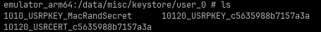

# Android Keystore

## Overview

Android keystore is a container within the android system to securely store cryptographic keys for any applications. These keys are used by applications for various encryption/decryption process within their application. 

## Keystore vs Keychain

Keychain offers system-wide credentials and flexibility for user to **select** which key the application can use across different applications. Keystore only lets credentials be accessed within the application it has rights to. Having a secure container would help prevent key leaking to other similar privileged applications that may have malicious functions. User **do not need** to select credentials for applications that uses keystore.

## Keystore Security Features

### Extraction Prevention

System process takes in data from the application and make use of the stored key and given parameters to perform cryptographic operations. Furthermore, stored keys are bounded to Android [Trusted Execution Environment](https://source.android.com/docs/security/features/trusty) or Secure Element (SE) which prevents key extraction even if device is compromise. However, it does not prevent usage of stored keys if application is compromised (e.g. Frida hooks)

### Hardware Security Module

Android 9 and above have [StrongBox](https://source.android.com/docs/security/features/keystore) that contains its own set of hardware modules and resources not used by standard Android OS and kernel. It offers mechanisms to prevent tampering of data within the keystore and secure storage to prevent unauthorised access. Unfortunately, not every android device supports StrongBox. List of supported devices: [here](https://www.android-device-security.org/database/?show=Trusted%20Execution%20Environment;Strongbox&sortBy=COUNT%20Lab%20Strongbox%20True;COUNT%20Lab%20Strongbox%20False&order=-1&preDefinedScore=defaultSecurity&securityScoreLabel-API%20Level=High&securityScoreLabel-Patchlevel=High&securityScoreLabel-Fingerprint=Low&securityScoreLabel-Keymaster%20Version=Moderate&securityScoreLabel-Key%20Attestation%20Unique%20ID=High&securityScoreLabel-Keystore%20Export=High&securityScoreLabel-Keystore%20Import=Low&securityScoreLabel-OpenApi%20eSE=Low&securityScoreLabel-Embedded%20SIM%20(eSIM)=Low&securityScoreLabel-Strongbox=High&securityScoreLabel-A%2FB%20System%20Updates=High&securityScoreLabel-Identity%20Credential=High&securityScoreLabel-Protected%20Confirmation=High&securityScoreLabel-Trusted%20Execution%20Environment=High&securityScoreLabel-Encrypted%20Shared%20Preferences=High&securityScoreLabel-Android%20Virtualization%20Framework=Moderate&securityScoreLabel-Multiple%20User%20Support=High&securityScoreCalculationApproach=true&page=1&rows=25)

### Key Use Authorisations

Feature for applications to only authorise specific tasks to make use of the cryptographic keys. Temporal validity interval can be implemented to allow specified time range to use the cryptograhpic keys and/or user authentication via biometric or lock screen checks. Both features could still be bypassed with the combination of Frida hooking to reset the time as well as disabling user's lock screen credentials.

## Is Keystore 100% Secure?

Android developer documentation states that keystore helps reduce risk of authorised use of cryptographic key outside and within the android device. As mentioned previously, the main issue is still security of android application.

This is a guide to monitor encryption process within the application:


Frida script to extract keystore via hooking of application:


A whole suite of documentation about Android Keystore Security, bypass and mitigations:


Furthermore, if the device is rooted, keystore is no longer secure and can be accessed with privileged rights:

## Interview Questions

* Could you explain the difference between android keystore and keychain?
* What are the security features of using android keystore?
* Are there any methods to bypass android keystore? 

## Author

- [Zheng Jie](https://github.com/Bread7)

## References

1. [Remote Rocketship - Android Security Questions](https://www.remoterocketship.com/advice/guide/android-engineer/android-security-specialist-interview-questions-and-answers)
2. [Android - Keystore System](https://developer.android.com/privacy-and-security/keystore)
3. [KC57 - Frida to Monitor Encryption](https://kc57.com/mobile-hacking-using-frida-to-monitor-encryption/)
4. [Codeshare - Frida Extract Keystore](https://codeshare.frida.re/@ceres-c/extract-keystore/)
5. [WithSecure - Android Keystore authentication](https://labs.withsecure.com/publications/how-secure-is-your-android-keystore-authentication)
6. [Huli - Android App Reverse Engineering](https://blog.huli.tw/2023/04/27/en/android-apk-decompile-intro-4/)