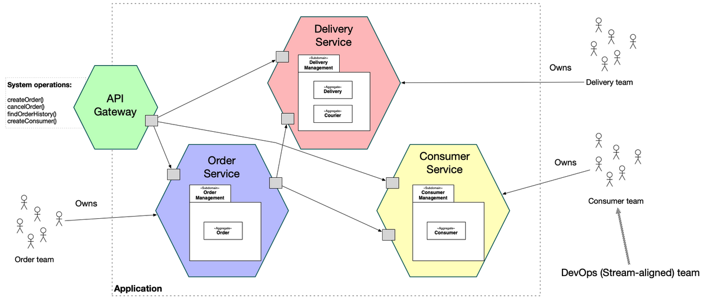
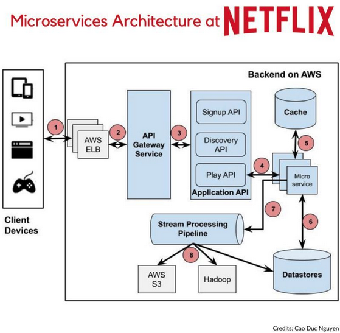

# Microservices Overview

## What are Microservices?

It is an **architectural** pattern for structuring software. It promotes the use of services to be **independently deployable** and **loosely coupled** to allow scalability while providing isolation for each services. It is great for collaboration between software and DevOps teams.

## Use Cases

### Website Migration

Migration from other architectural patterns such as monolithic or layered which allows for greater modularity and scaling of application. Application can be migrated into a cloud-based and/or container-based platform for easier management.

### Media Content

Images and video assets can be stored in scalable object storage system for quick and efficient way to serving to consumers.

### Transactions and Invoices

Payemnts and processing can be separate independent services so even if one payment option stops working, other services can still operate as per normal.

### Data Processing

Application with microservices can extend with other existing data processing or cloud services and process in parallel.

## Case Study: Netflix

Due to their previous Monolithic pattern, there were many potential single point of failures and bugs in their singular codebase. Hence, their migration to Microservices allows breaking up of their codebase into different specialised service codebase. As a result, this promotes vertical scaling due to smaller codebase, CI/CD with frequent updates and faster release cycles without impacting other services and maintainability of each service codebase for different teams.

## Cons

### Increased Complexity

Data consistency and communication between each services becomes harder to maintain. Due to separation of services, each services may have their own potential point of failure if not created properly and it may make troubleshooting difficult

### Increased Cost

Since each services has become independent, tooling and deployment services will multiply depending on the infrastructure of each services.

### Organisational Overhead

Teams have to transition to be more autonomous and cross-functional which requires new tools and processes to adjust to their new workflow.

## Interview Questions

* What are the main features of Microservices?
* Explain some use cases of Microservices?
* What are some negatives of using/transitioning to Microserives?

## Author

- [Zheng Jie](https://github.com/Bread7) 🍞

## References

1. [Microservices](https://microservices.io/)
2. [Google - Microservices Architecture](https://cloud.google.com/learn/what-is-microservices-architecture#section-3)
3. [Codesee - Microservices vs Monolith](https://www.codesee.io/learning-center/microservices-vs-monolith)
4. [Huzaifa - Microservices Netflix](https://www.linkedin.com/pulse/monolithic-vs-microservices-architecture-case-study-netflix-asif/)
5. [Shah Rukh Khan - Layered, Microservices and Modular Monolithic](https://medium.com/@shahrukhkhan_7802/layered-microservices-and-modular-monolithic-454efda8b2df)
