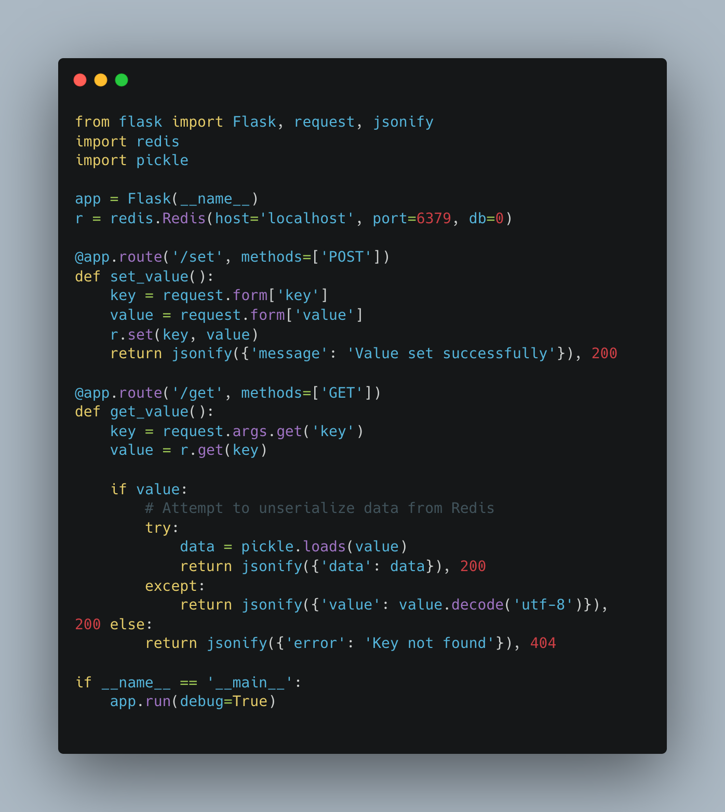
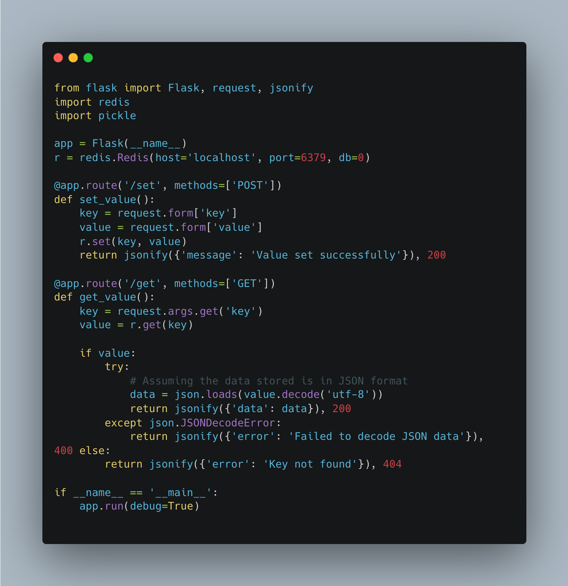

# Code Review

So here is a code that uses a Flask web server with routes to set and get values stored in a Redis database. The values retrieved from Redis are unserialized using Python `pickle` module.

**Spot the vulnerability in this code snippet!**

<figure><figcaption>
Code Review Challenge
</figcaption></figure>

**Are you able to find the vulnerability?**

The vulnerability code: `data = pickle.loads(value)`

`Pickle` is a powerful module for serializing and deserializing objects in Python. **However**, it is infamously insecure when used with untrusted data! The vulnerability lies in `pickle.loads()` which can execute arbitrary code contained within the data it is attempting to unserialize.&#x20;

This is known as **Insecure Deserialization** where user-controlled data is deserialized by a website. **Deserialization** is the process of restoring this byte stream to a fully functional replica of the original object.

<figure><figcaption>
Process of Serialization and Deserialization. Credits: Portswigger
</figcaption></figure>

If an attacker can store malicious data in the Redis cache, he/she could craft a payload that leads to remote code execution.&#x20;

**So, how can we fix this vulnerability?**

For starters, we should not use `pickle` to unserialize data coming from an untrusted or controllable source. We can use a safer format like JSON which does not allow code execution

<figure><figcaption>
A possible code solution
</figcaption></figure>

## Author

- [Isaac](https://github.com/frostsg)