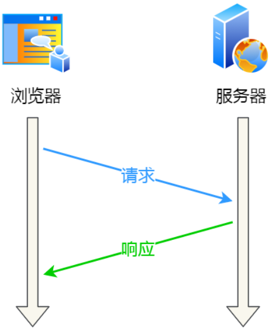
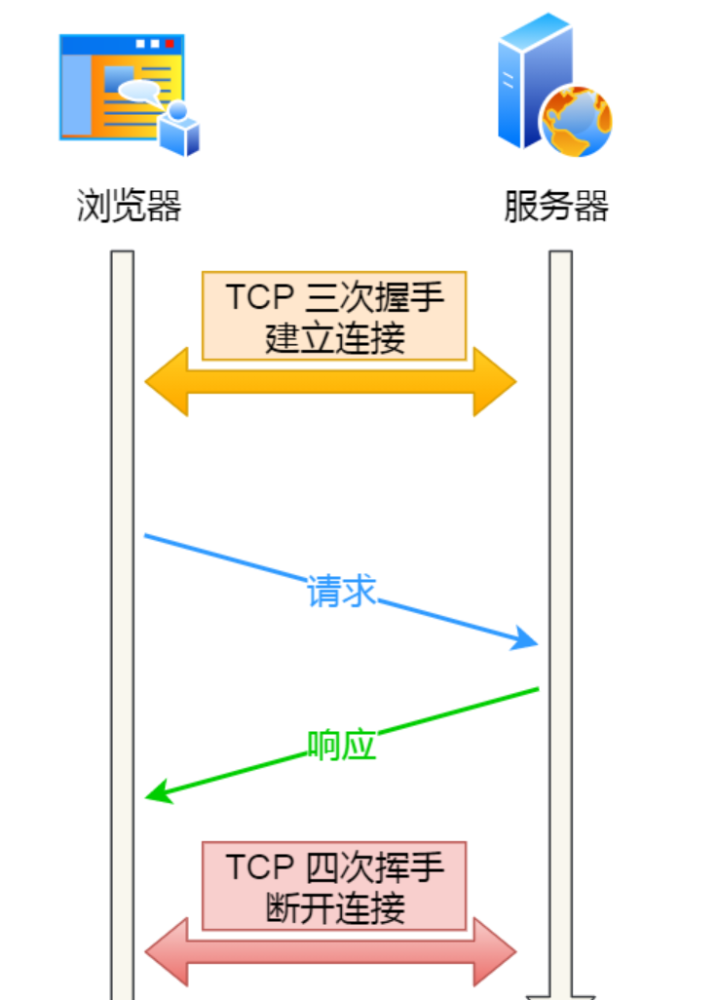
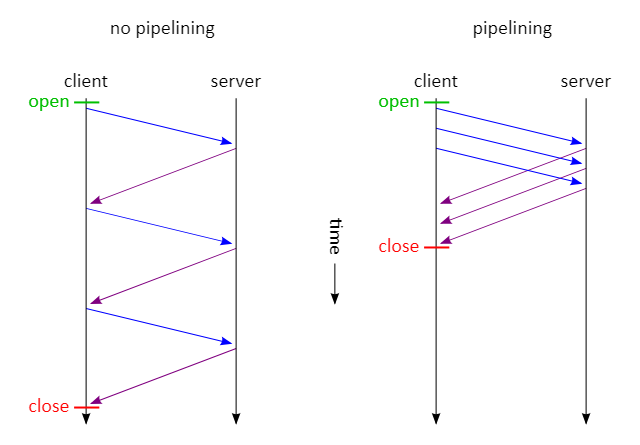

# Persistent Connection and Non Persistent

Interview question:


**What is the difference between Persistent connection and non-persistent connection.**

## HTTP Keep-live

Http protocol used the `request` - `Response` mode, when client request, the server will then response.

<figure><figcaption></figcaption></figure>

Since HTTP is implemented based on the TCP transport protocol, the client and server need to establish a TCP connection before HTTP communication can occur. Then, the client sends an HTTP request, and once the server receives it, it returns a response. This completes the "request-response" pattern, after which the TCP connection is released.

<figure><figcaption></figcaption></figure>

for each request had to go through this process:&#x20;

establish TCP -> request resources -> respond with resources -> release connection

&#x20;it would indeed be **too cumbersome**, as a connection could only request a resource once.

Is it possible to not disconnect the TCP connection after the first HTTP request, allowing subsequent HTTP requests to continue using this connection?

Certainly, HTTP Keep-Alive achieves this functionality by using the same TCP connection to send and receive multiple HTTP requests/responses. This avoids the overhead of establishing and releasing connections and is known as an **HTTP Persistence connection.**

## How to use Keep-Alive function

#### HTTP 1.0

In **HTTP 1.0**, default it is closed, only if browser want to activate it must add in the request header

```
Connection: Keep-Alive
```

When server side receive the request, it will reply with a header in response too

```
Connection: Keep-Alive
```

By doing so, the connection is not interrupted but maintained. When the client sends another request, it uses the same connection. This continues until either the **client or the server decides to terminate the connection.**

#### HTTP 1.1

The default mode is browser will enable `Keep-Alive` . To disable Keep-Alive, you need to add the following line to the HTTP request header:

```
Connection: close
```

### HTTP PipeLining

\
HTTP persistent connections not only reduce the overhead of TCP connection resources but also provide a feasible foundation for HTTP pipelining technology.

HTTP pipelining allows the client to send multiple requests at once without waiting for the server's response before sending subsequent requests, which can decrease the overall response time.

For instance, if a client needs to request two resources, the traditional approach would be to send request A within the same TCP connection, wait for the server to respond, and then send request B. The HTTP pipelining mechanism, on the other hand, permits the client to issue requests A and B simultaneously.

<figure><figcaption></figcaption></figure>

So here comes the question:**If HTTP persistent connections are used, and the client does not initiate any new requests after completing an HTTP request, wouldn't this continuous occupation of the TCP connection be quite wasteful of resources?**

To avoid the waste of resources, web service software generally provides a **keepalive\_timeout** parameter to specify the timeout for HTTP persistent connections.

For example, if the timeout for HTTP persistent connections is set to 60 seconds, the web service software will start a timer. If the client does not initiate any new requests within 60 seconds after completing the last HTTP request, once the timer expires, it will trigger a callback function to **release the connection.**
