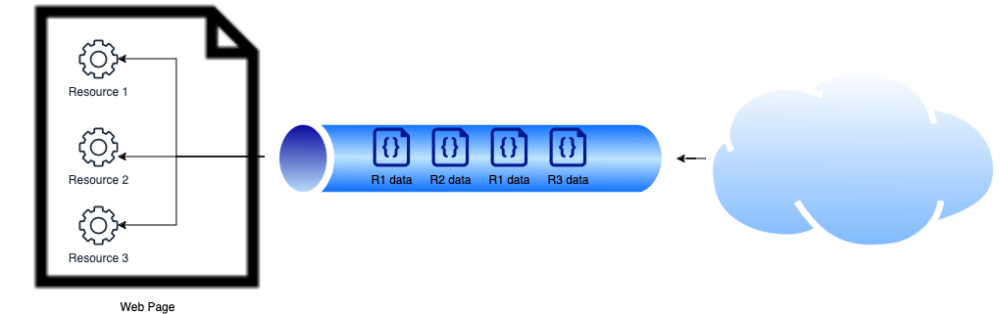
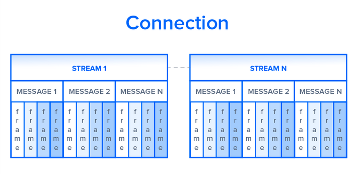
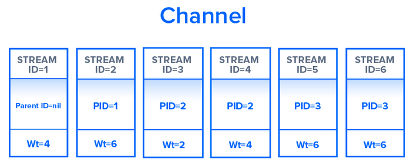
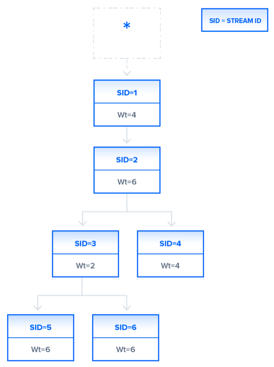

# Overview

HTTP/2 was developed in 2015 by Google, to help address web latency by offering efficient loading processes via prioritization methods. Furthermore, it makes use of compression into a binary framing layer which increases speed of transfer for streaming and encapsulation of data. It differs in how data can be transferred as compared to HTTP/1.1 which sends data via plaintext. For simplicity, RESTful APIs are used to reference the different requests in this article.

## Data Delivery

### HTTP/1.1

HTTP/1.1 makes use of TCP Persistent Connection ([discussed by Chen Xing](./connection-persistence.md)) to perform multiple `GET` requests to different resouce link to fully render a page. However, a bottleneck may occur as data can only be retrieved in a queue, which will cause different resource to be put on hold until the data can be retrieved. Parallel TCP connections can help allieviate the bottleneck but requires more resource per connection.



### HTTP/2

HTTP/2 encodes and compresses data into binary format for flexibility of data transfer. Moreover, within a single connection, it comprises of multiple streams of data that can run in parallel without blocking other messages (multiplexing). Server can make use of this to manage connections per origin, reducing memory and processing resources.



HTTP/2 also offers stream prioritisation on each stream connection with a parent ID and an assigned weight between 1 and 256 (higher number == higher priority). This offers granular control by having a dependency tree on which stream should be loaded first based on parent stream followed by their weight value. For example, a web page can load a thumbnail, while leaving ads with lower priority to retrieve at a later time.





Header is compress using [HPACK](https://tools.ietf.org/html/draft-ietf-httpbis-header-compression-12) and encoded with Huffman Coding to decrease the payload size and keep track of data header's metadata.

```sh
# Request 1 + 2 original headers
method:		GET                 | method:		GET                 
scheme:		https               | scheme:       https
host:		example.com         | host:         example.com
path:		/academy            | path:         /academy/images
accept:		/image/jpeg         | accept:       /image/jpeg
user-agent:	Mozilla/5.0 ...     | user-agent:   Mozilla/5.0
```

```sh
# Request 1 + 2 HTTP/2 headers
method:		GET                 | 
scheme:		https               | 
host:		example.com         | 
path:		/academy            | path:         /academy/images
accept:		/image/jpeg         |
user-agent:	Mozilla/5.0 ...     |
```

## Performance

### Multiplexing

HTTP/1.1 fallacy is in how data is loaded in which other resources in queue will be blocked as well if a resource cannot be loaded. However, HTTP/2's streams within a TCP connection are able to transmit independently and can be further optimised by appropriate stream splitting.


### Header Compression

HTTP/1.1 commonly uses gzip/compress/defalte for compression purposes if needed. However, HTTP/2 uses advanced compression method of HPACK which can reduce redundant information in HTTP headers as well as reducing the size of data payload better than HTTP/1.1 offerings. These helps to load resource faster which permits more requests to be taken on.

## Interview Questions

* Expain feature differences of HTTP/1.1 and HTTP/2.
* Why is HTTP/2 Server Push not effective despite being a feature? What are the alternatives to HTTP/2 Server Push.
* Should a new web project use HTTP/2 as the only supported HTTP protocol? Explain why?


## Author

- [Zheng Jie](https://github.com/Bread7) 🍞

## References

1. [Digital Ocean - HTTP/1.1 vs HTTP/2](https://www.digitalocean.com/community/tutorials/http-1-1-vs-http-2-what-s-the-difference#compression)
2. [Cloudflare - HTTP/2 vs HTTP/1.1 Performance](https://www.cloudflare.com/learning/performance/http2-vs-http1.1/)