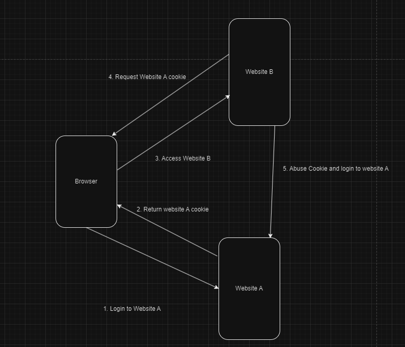

# Same-origin Policy (SOP)

## Introduction

The Same-Origin Policy means that if the **domain name, protocol, and port are the same,** then it is considered to be the same origin. The Same-Origin Policy is a security measure implemented by browsers that dictates which website content can be accessed by JavaScript, thereby protecting the data on a website from being accessed by other websites.

Here is a simple example: Imagine we use a browser to log into website A. The first time we log in, we need to enter our username and password. For convenience during subsequent visits, we won't need to enter the username and password again, as the server will return a credential -- a Cookie. The browser will store this credential, and the next time we use this browser to visit website A, the site will ask the browser if it has the cookie. If it does, the login process will be skipped.

Note: The Cookie is only stored in the current browser. If you switch browsers, you will need to enter your username and password again.

The Same-Origin Policy applies to web browsers. Imagine if we didn't have the Same-Origin Policy, and a user named Xiao Hei logs into website A and then visits website B. Website B could read the cookie from website A and use this cookie to impersonate the user to log into website A.

<figure><figcaption></figcaption></figure>

## How to check if same origin

### Protocol

Different protocol

```
http://example.com
https://example.com
ftp://example.com
```

### Domain

Different domain

```
http://example.com
http://test.example.com <-- subdomain also consisted different 
http://test.com
```

### Port

Different port

```
http://example.com
https://example.com <-- port 443
http://example.com:8080
```

Do note that for **localhost and 127.0.01 even both point to same host, but its different origin.**

### Example questions

For example, consider the following URL:

```
http://normal-website.com/example/example.html
```

<table><thead><tr><th width="445">URL accessed</th><th>Access permitted?</th></tr></thead><tbody><tr><td><code>http://normal-website.com/example/</code></td><td>Yes: same scheme, domain, and port</td></tr><tr><td><code>http://normal-website.com/example2/</code></td><td>Yes: same scheme, domain, and port</td></tr><tr><td><code>https://normal-website.com/example/</code></td><td>No: different scheme and port</td></tr><tr><td><code>http://en.normal-website.com/example/</code></td><td>No: different domain</td></tr><tr><td><code>http://www.normal-website.com/example/</code></td><td>No: different domain</td></tr><tr><td><code>http://normal-website.com:8080/example/</code></td><td>No: different port*</td></tr></tbody></table>

Resource from portswigger ^

## Interview question

1\) What is SOP?

2\) SOP is a mechanism from server or browser?

3\) What are the 3 factor determine if 2 website is same origin?

4\) Does 127.0.0.1 and localhost considered the same origin?

5\) Does http://test.com/path1 and http://test.com/path2 consider the same origin?

## Author

- [Chen Xing](https://github.com/Ik0nw)